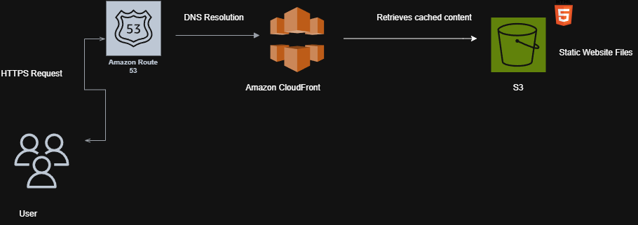

# AWS Cloud Portfolio Website

A secure static portfolio website hosted on **Amazon S3** and delivered globally using **Amazon CloudFront**.

## Live Website

https://d10qv678l2lt0g.cloudfront.net/

---

## Project Overview

This project demonstrates how to design and deploy a secure, scalable static website using AWS cloud services.

The website includes:

- Professional profile
- Technical skills
- AWS certifications
- Cloud projects
- GitHub profile
- LinkedIn profile
- Downloadable CV

---

## AWS Services Used

- Amazon S3
- Amazon CloudFront
- Origin Access Control (OAC)
- IAM
- HTTPS

---

## Architecture

```
User
   │
HTTPS
   │
CloudFront
   │
Origin Access Control
   │
Private Amazon S3 Bucket
   │
HTML • CSS • Images • PDF
```

---

## Skills Demonstrated

- AWS Architecture
- Amazon S3
- CloudFront
- IAM
- Static Website Hosting
- Cloud Security
- HTML
- CSS
- Git
- GitHub

---

## Future Improvements

- Route 53 Custom Domain
- AWS Certificate Manager
- GitHub Actions CI/CD
- Terraform Deployment
- CloudWatch Monitoring

---

## Author

Kelvin Onyeogu

LinkedIn

https://www.linkedin.com/in/ebuka-kelvin-onyeogu

GitHub

https://github.com/kelvinkabe